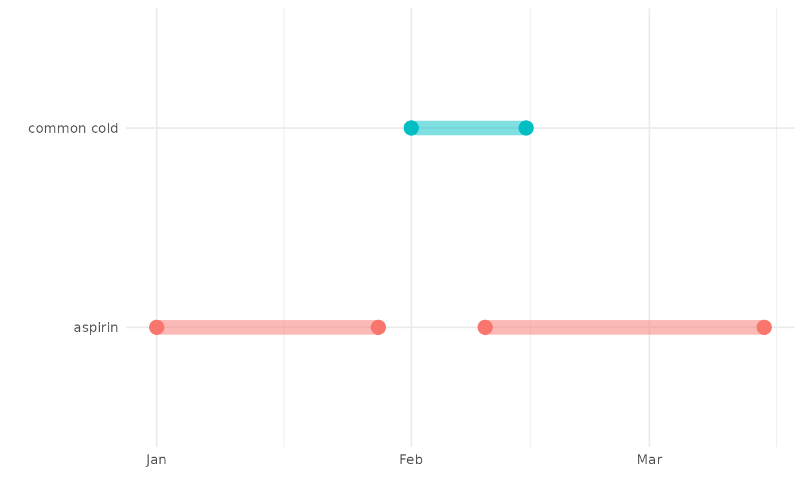

# Adding cohort intersections

## Introduction

Cohorts are often a key component in studies that use the OMOP CDM. They
may be created to represent various clinical events of interest and we
often use cohorts in combination, whether it is to identify outcomes
among people with an exposure of interest, report baseline comorbidites
among a certain study population, or for many other possible reasons.

Cohorts have a particular format in the OMOP CDM, which we can see for
two cohort tables created by the
[`mockPatientProfiles()`](https://darwin-eu.github.io/PatientProfiles/reference/mockPatientProfiles.md)
function provided by PatientProfiles, which mimics a database in the
OMOP CDM format. We can see the first cohort table contains 2 cohorts
while the second contains 3 cohorts.

``` r
library(PatientProfiles)
library(dplyr)
library(ggplot2)

cdm <- mockPatientProfiles(numberIndividuals = 1000, source = "duckdb")

cdm$cohort1 |>
  glimpse()
```

    ## Rows: ??
    ## Columns: 4
    ## Database: DuckDB 1.4.4 [unknown@Linux 6.11.0-1018-azure:R 4.5.2/:memory:]
    ## $ cohort_definition_id <int> 2, 1, 1, 2, 2, 3, 2, 3, 1, 2, 2, 2, 2, 1, 1, 1, 3…
    ## $ subject_id           <int> 503, 261, 750, 1, 445, 523, 899, 929, 925, 200, 6…
    ## $ cohort_start_date    <date> 2004-08-05, 1976-07-21, 1978-01-02, 1916-08-27, …
    ## $ cohort_end_date      <date> 2005-12-14, 1979-07-22, 1980-06-14, 1946-04-06, …

``` r
settings(cdm$cohort1)
```

    ## # A tibble: 3 × 2
    ##   cohort_definition_id cohort_name
    ##                  <int> <chr>      
    ## 1                    1 cohort_1   
    ## 2                    2 cohort_2   
    ## 3                    3 cohort_3

``` r
cdm$cohort2 |>
  glimpse()
```

    ## Rows: ??
    ## Columns: 4
    ## Database: DuckDB 1.4.4 [unknown@Linux 6.11.0-1018-azure:R 4.5.2/:memory:]
    ## $ cohort_definition_id <int> 3, 1, 1, 3, 1, 2, 1, 1, 2, 2, 3, 2, 2, 3, 1, 3, 1…
    ## $ subject_id           <int> 576, 112, 58, 256, 335, 291, 294, 615, 782, 721, …
    ## $ cohort_start_date    <date> 1956-05-21, 1978-06-11, 1921-03-26, 1955-04-22, …
    ## $ cohort_end_date      <date> 1973-09-24, 2001-11-10, 1923-07-03, 1955-07-27, …

``` r
settings(cdm$cohort2)
```

    ## # A tibble: 3 × 2
    ##   cohort_definition_id cohort_name
    ##                  <int> <chr>      
    ## 1                    1 cohort_1   
    ## 2                    2 cohort_2   
    ## 3                    3 cohort_3

## Identifying cohort intersections

PatientProfiles provides four functions for identifying cohort
intersections (the presence of an individual in two cohorts). The first
[`addCohortIntersectFlag()`](https://darwin-eu.github.io/PatientProfiles/reference/addCohortIntersectFlag.md)
adds a flag of whether someone appeared in the other cohort during a
time window. The second,
[`addCohortIntersectCount()`](https://darwin-eu.github.io/PatientProfiles/reference/addCohortIntersectCount.md),
counts the number of times someone appeared in the other cohort in the
window. A third,
[`addCohortIntersectDate()`](https://darwin-eu.github.io/PatientProfiles/reference/addCohortIntersectDate.md),
adds the date when the intersection occurred. And the fourth,
[`addCohortIntersectDays()`](https://darwin-eu.github.io/PatientProfiles/reference/addCohortIntersectDays.md),
adds the number of days to the intersection.

We can see each of these below. Note that they add variables to our
cohort table of interest, and identify intersections over a given
window. As we can see, if our target cohort table contains multiple
cohorts then by default these functions will add one new variable per
cohort.

Let’s start by adding flag and count variables using a window of 180
days before to 180 days after the cohort start date in our table of
interest. By default the cohort start date of our cohort of interest
will be used as the index date, with the cohort start to cohort end date
of the target cohort then used to check for an intersection.

``` r
cdm$cohort1 |>
  addCohortIntersectFlag(
    indexDate = "cohort_start_date",
    targetCohortTable = "cohort2",
    targetStartDate = "cohort_start_date",
    targetEndDate = "cohort_end_date",
    window = list(c(-180, 180))
  ) |>
  glimpse()
```

    ## Rows: ??
    ## Columns: 7
    ## Database: DuckDB 1.4.4 [unknown@Linux 6.11.0-1018-azure:R 4.5.2/:memory:]
    ## $ cohort_definition_id <int> 3, 2, 3, 1, 1, 1, 1, 3, 1, 2, 3, 2, 3, 2, 1, 2, 3…
    ## $ subject_id           <int> 523, 899, 778, 85, 222, 140, 70, 591, 54, 137, 77…
    ## $ cohort_start_date    <date> 1962-10-26, 1950-03-28, 1925-07-30, 1939-09-06, …
    ## $ cohort_end_date      <date> 1974-01-15, 1976-07-06, 1936-05-29, 1942-05-25, …
    ## $ cohort_1_m180_to_180 <dbl> 0, 1, 1, 0, 1, 0, 0, 0, 1, 1, 0, 0, 0, 1, 0, 1, 0…
    ## $ cohort_2_m180_to_180 <dbl> 0, 0, 0, 0, 0, 1, 1, 0, 0, 0, 1, 0, 0, 0, 1, 0, 1…
    ## $ cohort_3_m180_to_180 <dbl> 1, 0, 0, 1, 0, 0, 0, 1, 0, 0, 0, 1, 1, 0, 0, 0, 0…

``` r
cdm$cohort1 |>
  addCohortIntersectCount(
    indexDate = "cohort_start_date",
    targetCohortTable = "cohort2",
    targetStartDate = "cohort_start_date",
    targetEndDate = "cohort_end_date",
    window = list(c(-180, 180))
  ) |>
  glimpse()
```

    ## Rows: ??
    ## Columns: 7
    ## Database: DuckDB 1.4.4 [unknown@Linux 6.11.0-1018-azure:R 4.5.2/:memory:]
    ## $ cohort_definition_id <int> 3, 2, 3, 1, 1, 1, 1, 3, 1, 2, 3, 2, 3, 2, 1, 2, 3…
    ## $ subject_id           <int> 523, 899, 778, 85, 222, 140, 70, 591, 54, 137, 77…
    ## $ cohort_start_date    <date> 1962-10-26, 1950-03-28, 1925-07-30, 1939-09-06, …
    ## $ cohort_end_date      <date> 1974-01-15, 1976-07-06, 1936-05-29, 1942-05-25, …
    ## $ cohort_1_m180_to_180 <dbl> 0, 1, 1, 0, 1, 0, 0, 0, 1, 1, 0, 0, 0, 1, 0, 1, 0…
    ## $ cohort_2_m180_to_180 <dbl> 0, 0, 0, 0, 0, 1, 1, 0, 0, 0, 1, 0, 0, 0, 1, 0, 1…
    ## $ cohort_3_m180_to_180 <dbl> 1, 0, 0, 1, 0, 0, 0, 1, 0, 0, 0, 1, 1, 0, 0, 0, 0…

Next we can add the date of the intersection and the days to the
intersection. When identifying these variables we use only one date in
our target table, which by default will be the cohort start date. In
addition by default the first intersection that occurs within our window
will be used.

``` r
cdm$cohort1 |>
  addCohortIntersectDate(
    indexDate = "cohort_start_date",
    targetCohortTable = "cohort2",
    targetDate = "cohort_start_date",
    window = list(c(-180, 180)),
    order = "first"
  ) |>
  glimpse()
```

    ## Rows: ??
    ## Columns: 7
    ## Database: DuckDB 1.4.4 [unknown@Linux 6.11.0-1018-azure:R 4.5.2/:memory:]
    ## $ cohort_definition_id <int> 2, 1, 1, 2, 2, 3, 2, 3, 1, 2, 2, 2, 2, 1, 1, 1, 3…
    ## $ subject_id           <int> 503, 261, 750, 1, 445, 523, 899, 929, 925, 200, 6…
    ## $ cohort_start_date    <date> 2004-08-05, 1976-07-21, 1978-01-02, 1916-08-27, …
    ## $ cohort_end_date      <date> 2005-12-14, 1979-07-22, 1980-06-14, 1946-04-06, …
    ## $ cohort_1_m180_to_180 <date> NA, NA, NA, NA, NA, NA, NA, NA, NA, NA, NA, NA, …
    ## $ cohort_2_m180_to_180 <date> NA, NA, NA, NA, NA, NA, NA, NA, NA, NA, NA, NA, …
    ## $ cohort_3_m180_to_180 <date> NA, NA, NA, NA, NA, NA, NA, NA, NA, NA, NA, NA, …

``` r
cdm$cohort1 |>
  addCohortIntersectDays(
    indexDate = "cohort_start_date",
    targetCohortTable = "cohort2",
    targetDate = "cohort_start_date",
    window = list(c(-180, 180)),
    order = "first"
  ) |>
  glimpse()
```

    ## Rows: ??
    ## Columns: 7
    ## Database: DuckDB 1.4.4 [unknown@Linux 6.11.0-1018-azure:R 4.5.2/:memory:]
    ## $ cohort_definition_id <int> 2, 1, 1, 2, 2, 3, 2, 3, 1, 2, 2, 2, 2, 1, 1, 1, 3…
    ## $ subject_id           <int> 503, 261, 750, 1, 445, 523, 899, 929, 925, 200, 6…
    ## $ cohort_start_date    <date> 2004-08-05, 1976-07-21, 1978-01-02, 1916-08-27, …
    ## $ cohort_end_date      <date> 2005-12-14, 1979-07-22, 1980-06-14, 1946-04-06, …
    ## $ cohort_1_m180_to_180 <dbl> NA, NA, NA, NA, NA, NA, NA, NA, NA, NA, NA, NA, N…
    ## $ cohort_2_m180_to_180 <dbl> NA, NA, NA, NA, NA, NA, NA, NA, NA, NA, NA, NA, N…
    ## $ cohort_3_m180_to_180 <dbl> NA, NA, NA, NA, NA, NA, NA, NA, NA, NA, NA, NA, N…

## Options for identifying cohort intersection

To consider the impact of the different options we can choose when
identifying cohort intersections let´s consider a toy example with a
single patient with common cold (diagnosed on the 1st February 2020 and
ending on the 15th February 2020). This person had two records for
aspirin, one ending shortly before their start date for common cold and
the other starting during their record for common cold.

``` r
common_cold <- tibble(
  cohort_definition_id = 1,
  subject_id = 1,
  cohort_start_date = as.Date("2020-02-01"),
  cohort_end_date = as.Date("2020-02-15")
)

aspirin <- tibble(
  cohort_definition_id = c(1, 1),
  subject_id = c(1, 1),
  cohort_start_date = as.Date(c("2020-01-01", "2020-02-10")),
  cohort_end_date = as.Date(c("2020-01-28", "2020-03-15"))
)
```

We can visualise what this person’s timeline looks like.

``` r
bind_rows(
  common_cold |> mutate(cohort = "common cold"),
  aspirin |> mutate(cohort = "aspirin")
) |>
  mutate(record = as.character(row_number())) |>
  ggplot() +
  geom_segment(
    aes(
      x = cohort_start_date,
      y = cohort,
      xend = cohort_end_date,
      yend = cohort, col = cohort, fill = cohort
    ),
    size = 4.5, alpha = .5
  ) +
  geom_point(aes(x = cohort_start_date, y = cohort, color = cohort), size = 4) +
  geom_point(aes(x = cohort_end_date, y = cohort, color = cohort), size = 4) +
  ylab("") +
  xlab("") +
  theme_minimal() +
  theme(legend.position = "none")
```



Whether we consider there to be a cohort intersection between the common
cold and aspirin cohorts will depend on what options we choose. To see
this let’s first create a cdm reference containing our example.

``` r
cdm <- mockPatientProfiles(
  cohort1 = common_cold,
  cohort2 = aspirin,
  numberIndividuals = 2,
  source = "duckdb"
)
```

If we consider the intersection relative to the cohort start date for
common cold with a window of 0 to 0 (ie only the index date) then no
intersection will be identified as the individual did not have an
ongoing record for aspirin on that date.

``` r
cdm$cohort1 |>
  addCohortIntersectFlag(
    targetCohortTable = "cohort2",
    indexDate = "cohort_start_date",
    targetStartDate = "cohort_start_date",
    targetEndDate = "cohort_end_date",
    window = list(c(0, 0)),
  ) |>
  glimpse()
```

    ## Rows: ??
    ## Columns: 5
    ## Database: DuckDB 1.4.4 [unknown@Linux 6.11.0-1018-azure:R 4.5.2/:memory:]
    ## $ cohort_definition_id <int> 1
    ## $ subject_id           <int> 1
    ## $ cohort_start_date    <date> 2020-02-01
    ## $ cohort_end_date      <date> 2020-02-15
    ## $ cohort_1_0_to_0      <dbl> 0

We could, however, change the index date to cohort end date in which
case an intersection would be found.

``` r
cdm$cohort1 |>
  addCohortIntersectFlag(
    targetCohortTable = "cohort2",
    indexDate = "cohort_end_date",
    targetStartDate = "cohort_start_date",
    targetEndDate = "cohort_end_date",
    window = list(c(0, 0))
  ) |>
  glimpse()
```

    ## Rows: ??
    ## Columns: 5
    ## Database: DuckDB 1.4.4 [unknown@Linux 6.11.0-1018-azure:R 4.5.2/:memory:]
    ## $ cohort_definition_id <int> 1
    ## $ subject_id           <int> 1
    ## $ cohort_start_date    <date> 2020-02-01
    ## $ cohort_end_date      <date> 2020-02-15
    ## $ cohort_1_0_to_0      <dbl> 1

Or we could also extend the window to include more time before or after
which in both cases would lead to cohort intersections being found.

``` r
cdm$cohort1 |>
  addCohortIntersectFlag(
    targetCohortTable = "cohort2",
    indexDate = "cohort_start_date",
    targetStartDate = "cohort_start_date",
    targetEndDate = "cohort_end_date",
    window = list(c(-90, 90)),
  ) |>
  glimpse()
```

    ## Rows: ??
    ## Columns: 5
    ## Database: DuckDB 1.4.4 [unknown@Linux 6.11.0-1018-azure:R 4.5.2/:memory:]
    ## $ cohort_definition_id <int> 1
    ## $ subject_id           <int> 1
    ## $ cohort_start_date    <date> 2020-02-01
    ## $ cohort_end_date      <date> 2020-02-15
    ## $ cohort_1_m90_to_90   <dbl> 1

With a window of 90 days before to 90 days after cohort start, the
person would have a count of two cohort intersections.

``` r
cdm$cohort1 |>
  addCohortIntersectCount(
    targetCohortTable = "cohort2",
    indexDate = "cohort_start_date",
    targetStartDate = "cohort_start_date",
    targetEndDate = "cohort_end_date",
    window = list(c(-90, 90)),
  ) |>
  glimpse()
```

    ## Rows: ??
    ## Columns: 5
    ## Database: DuckDB 1.4.4 [unknown@Linux 6.11.0-1018-azure:R 4.5.2/:memory:]
    ## $ cohort_definition_id <int> 1
    ## $ subject_id           <int> 1
    ## $ cohort_start_date    <date> 2020-02-01
    ## $ cohort_end_date      <date> 2020-02-15
    ## $ cohort_1_m90_to_90   <dbl> 2

With this same window, if we add the first cohort intersect date we will
get the start date of the first record of aspirin.

``` r
cdm$cohort1 |>
  addCohortIntersectDate(
    targetCohortTable = "cohort2",
    indexDate = "cohort_start_date",
    targetDate = "cohort_start_date",
    window = list(c(-90, 90)),
    order = "first"
  ) |>
  glimpse()
```

    ## Rows: ??
    ## Columns: 5
    ## Database: DuckDB 1.4.4 [unknown@Linux 6.11.0-1018-azure:R 4.5.2/:memory:]
    ## $ cohort_definition_id <int> 1
    ## $ subject_id           <int> 1
    ## $ cohort_start_date    <date> 2020-02-01
    ## $ cohort_end_date      <date> 2020-02-15
    ## $ cohort_1_m90_to_90   <date> 2020-01-01

But if we instead set order to last, we get the start date of the second
record of aspirin.

``` r
cdm$cohort1 |>
  addCohortIntersectDate(
    targetCohortTable = "cohort2",
    indexDate = "cohort_start_date",
    targetDate = "cohort_start_date",
    window = list(c(-90, 90)),
    order = "last"
  ) |>
  glimpse()
```

    ## Rows: ??
    ## Columns: 5
    ## Database: DuckDB 1.4.4 [unknown@Linux 6.11.0-1018-azure:R 4.5.2/:memory:]
    ## $ cohort_definition_id <int> 1
    ## $ subject_id           <int> 1
    ## $ cohort_start_date    <date> 2020-02-01
    ## $ cohort_end_date      <date> 2020-02-15
    ## $ cohort_1_m90_to_90   <date> 2020-02-10

## Naming conventions for new variables

One last option relates to the naming convention used to for the new
variables.

``` r
cdm$cohort1 |>
  addCohortIntersectDate(
    targetCohortTable = "cohort2",
    indexDate = "cohort_start_date",
    targetDate = "cohort_start_date",
    window = list(c(-90, 90)),
    order = "last",
    nameStyle = "{cohort_name}_{window_name}"
  ) |>
  glimpse()
```

    ## Rows: ??
    ## Columns: 5
    ## Database: DuckDB 1.4.4 [unknown@Linux 6.11.0-1018-azure:R 4.5.2/:memory:]
    ## $ cohort_definition_id <int> 1
    ## $ subject_id           <int> 1
    ## $ cohort_start_date    <date> 2020-02-01
    ## $ cohort_end_date      <date> 2020-02-15
    ## $ cohort_1_m90_to_90   <date> 2020-02-10

We can instead choose a specific name (but this will only work if only
one new variable will be added, otherwise we will get an error to avoid
duplicate names).

``` r
cdm$cohort1 |>
  addCohortIntersectDate(
    targetCohortTable = "cohort2",
    indexDate = "cohort_start_date",
    targetDate = "cohort_start_date",
    window = list(c(-90, 90)),
    order = "last",
    nameStyle = "my_new_variable"
  ) |>
  glimpse()
```

    ## Rows: ??
    ## Columns: 5
    ## Database: DuckDB 1.4.4 [unknown@Linux 6.11.0-1018-azure:R 4.5.2/:memory:]
    ## $ cohort_definition_id <int> 1
    ## $ subject_id           <int> 1
    ## $ cohort_start_date    <date> 2020-02-01
    ## $ cohort_end_date      <date> 2020-02-15
    ## $ my_new_variable      <date> 2020-02-10

In the other direction we could also include the estimate type in the
name. This will be useful, for example, if we’re adding multiple
different types of intersection values.

``` r
cdm$cohort1 |>
  addCohortIntersectDate(
    targetCohortTable = "cohort2",
    indexDate = "cohort_start_date",
    targetDate = "cohort_start_date",
    window = list(c(-90, 90)),
    order = "last",
    nameStyle = "{cohort_name}_{window_name}_{value}"
  ) |>
  addCohortIntersectDays(
    targetCohortTable = "cohort2",
    indexDate = "cohort_start_date",
    targetDate = "cohort_start_date",
    window = list(c(-90, 90)),
    order = "last",
    nameStyle = "{cohort_name}_{window_name}_{value}"
  ) |>
  glimpse()
```

    ## Rows: ??
    ## Columns: 6
    ## Database: DuckDB 1.4.4 [unknown@Linux 6.11.0-1018-azure:R 4.5.2/:memory:]
    ## $ cohort_definition_id    <int> 1
    ## $ subject_id              <int> 1
    ## $ cohort_start_date       <date> 2020-02-01
    ## $ cohort_end_date         <date> 2020-02-15
    ## $ cohort_1_m90_to_90_date <date> 2020-02-10
    ## $ cohort_1_m90_to_90_days <dbl> 9
