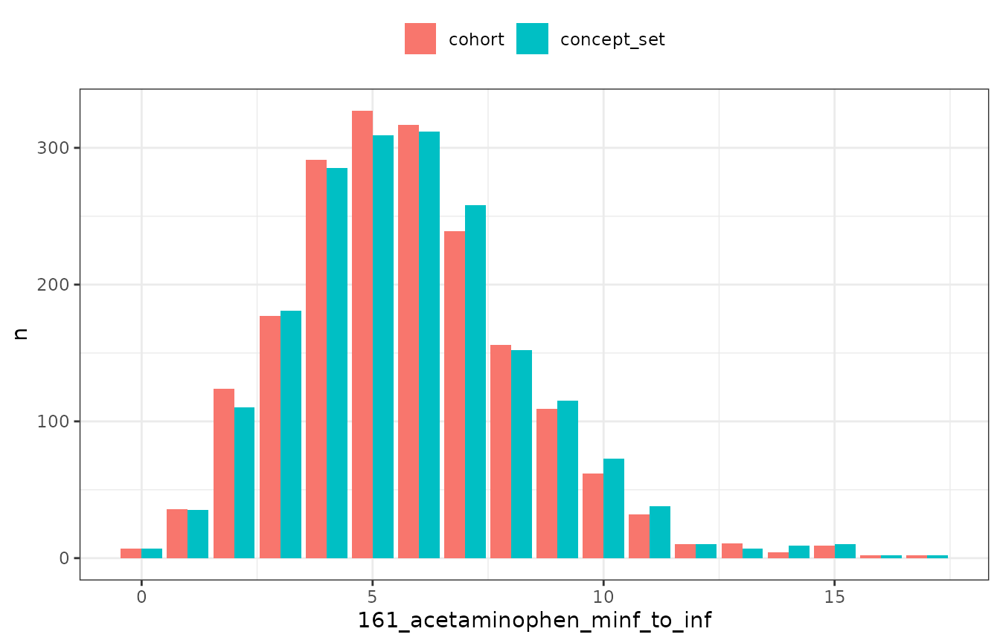

# Adding concept intersections

## Introduction

Concept sets play an important role when working with data in the format
of the OMOP CDM. They can be used to create cohorts after which, as
we’ve seen in the previous vignette, we can identify intersections
between the cohorts. PatientProfiles adds another option for working
with concept sets which is use them for adding associated variables
directly without first having to create a cohort.

It is important to note, and is explained more below, that results may
differ when generating a cohort and then identifying intersections
between two cohorts compared to working directly with concept sets. The
creation of cohorts will involve the collapsing of overlapping records
as well as imposing certain requirements such as only including records
that were observed during an individuals observation period. When adding
variables based on concept sets we will be working directly with
record-level data in the OMOP CDM clinical tables.

## Adding variables from concept sets

For this vignette we’ll use the Eunomia synthetic dataset. First lets
create our cohort of interest, individuals with an ankle sprain.

``` r

library(PatientProfiles)
library(CodelistGenerator)
#> Registered S3 method overwritten by 'CodelistGenerator':
#>   method            from        
#>   print.code_search omopgenerics
library(CohortConstructor)
library(dplyr)
#> 
#> Attaching package: 'dplyr'
#> The following objects are masked from 'package:stats':
#> 
#>     filter, lag
#> The following objects are masked from 'package:base':
#> 
#>     intersect, setdiff, setequal, union
library(ggplot2)
library(omock)

cdm <- mockCdmFromDataset(datasetName = "GiBleed", source = "duckdb")
#> ℹ Loading bundled GiBleed tables from package data.
#> ℹ Adding drug_strength table.
#> ℹ Creating local <cdm_reference> object.
#> ℹ Inserting <cdm_reference> into duckdb.
#> duckdb keeps downloaded extensions and secrets in a temporary directory:
#> ℹ /tmp/RtmpUX0HBb/duckdb
#> This is removed when the R session ends.
#> • Extensions are re-downloaded each session.
#> • Secrets are lost.
#> ℹ Run duckdb(shared_home = TRUE) (or create ~/.duckdb) to keep them (suitable for most users).
#> ℹ Run duckdb(shared_home = FALSE) to accept the temporary directory (and silence this message).
#> ℹ See ?duckdb_storage for details and alternatives.

cdm$ankle_sprain <- conceptCohort(
  cdm = cdm,
  conceptSet = list("ankle_sprain" = 81151),
  name = "ankle_sprain"
)
#> Warning: ! `codelist` cast to integers.
#> ℹ Subsetting table condition_occurrence using 1 concept with domain: condition.
#> ℹ Combining tables.
#> ℹ Creating cohort attributes.
#> ℹ Applying cohort requirements.
#> ℹ Merging overlapping records.
#> ✔ Cohort ankle_sprain created.

cdm$ankle_sprain
#> # A query:  ?? x 4
#> # Database: DuckDB 1.5.5 [unknown@Linux 6.17.0-1020-azure:R 4.6.1//tmp/RtmpUX0HBb/file23ecd62a596.duckdb]
#>    cohort_definition_id subject_id cohort_start_date cohort_end_date
#>                   <int>      <int> <date>            <date>         
#>  1                    1        140 1992-03-25        1992-04-22     
#>  2                    1       4160 1969-02-28        1969-04-04     
#>  3                    1       4398 1962-03-03        1962-04-07     
#>  4                    1       4409 1983-07-15        1983-08-19     
#>  5                    1       4963 1981-12-28        1982-02-01     
#>  6                    1        624 2014-08-30        2014-09-20     
#>  7                    1       1952 1962-01-22        1962-02-19     
#>  8                    1       3533 1996-07-03        1996-08-07     
#>  9                    1       4432 2014-06-27        2014-07-25     
#> 10                    1       4557 1951-12-21        1952-01-25     
#> # ℹ more rows
```

Now let’s say we’re interested in summarising use of acetaminophen among
our ankle sprain cohort. We can start by identifying the relevant
concepts.

``` r

acetaminophen_cs <- getDrugIngredientCodes(
  cdm = cdm,
  name = c("acetaminophen")
)

acetaminophen_cs
#> 
#> ── 1 codelist ──────────────────────────────────────────────────────────────────
#> 
#> - 161_acetaminophen (7 codes)
```

Once we have our codes for acetaminophen we can create variables based
on these. As with cohort intersections, PatientProfiles provides four
types of functions for concept intersections.

First, we can add a binary flag variable indicating whether an
individual had a record of acetaminophen on the day of their ankle
sprain or up to 30 days afterwards.

``` r

cdm$ankle_sprain |>
  addConceptIntersectFlag(
    conceptSet = acetaminophen_cs,
    indexDate = "cohort_start_date",
    window = c(0, 30)
  ) |>
  glimpse()
#> Rows: ??
#> Columns: 5
#> $ cohort_definition_id        <int> 1, 1, 1, 1, 1, 1, 1, 1, 1, 1, 1, 1, 1, 1, …
#> $ subject_id                  <int> 140, 4409, 624, 1952, 4432, 4557, 160, 374…
#> $ cohort_start_date           <date> 1992-03-25, 1983-07-15, 2014-08-30, 1962-…
#> $ cohort_end_date             <date> 1992-04-22, 1983-08-19, 2014-09-20, 1962-…
#> $ `161_acetaminophen_0_to_30` <dbl> 1, 1, 1, 1, 1, 1, 1, 1, 1, 1, 1, 1, 1, 1, …
```

Second, we can count the number of records of acetaminophen in this same
window for each individual.

``` r

cdm$ankle_sprain |>
  addConceptIntersectCount(
    conceptSet = acetaminophen_cs,
    indexDate = "cohort_start_date",
    window = c(0, 30)
  ) |>
  glimpse()
#> Rows: ??
#> Columns: 5
#> $ cohort_definition_id        <int> 1, 1, 1, 1, 1, 1, 1, 1, 1, 1, 1, 1, 1, 1, …
#> $ subject_id                  <int> 140, 4409, 624, 1952, 4432, 4557, 160, 374…
#> $ cohort_start_date           <date> 1992-03-25, 1983-07-15, 2014-08-30, 1962-…
#> $ cohort_end_date             <date> 1992-04-22, 1983-08-19, 2014-09-20, 1962-…
#> $ `161_acetaminophen_0_to_30` <dbl> 1, 1, 1, 1, 1, 1, 1, 1, 1, 1, 1, 1, 1, 1, …
```

Third, we could identify the first start date of acetaminophen in this
window.

``` r

cdm$ankle_sprain |>
  addConceptIntersectDate(
    conceptSet = acetaminophen_cs,
    indexDate = "cohort_start_date",
    window = c(0, 30),
    order = "first"
  ) |>
  glimpse()
#> Rows: ??
#> Columns: 5
#> $ cohort_definition_id        <int> 1, 1, 1, 1, 1, 1, 1, 1, 1, 1, 1, 1, 1, 1, …
#> $ subject_id                  <int> 140, 4409, 624, 1952, 4432, 4557, 160, 374…
#> $ cohort_start_date           <date> 1992-03-25, 1983-07-15, 2014-08-30, 1962-…
#> $ cohort_end_date             <date> 1992-04-22, 1983-08-19, 2014-09-20, 1962-…
#> $ `161_acetaminophen_0_to_30` <date> 1992-03-25, 1983-07-15, 2014-08-30, 1962-…
```

Or fourth, we can get the number of days to the start date of
acetaminophen in the window.

``` r

cdm$ankle_sprain |>
  addConceptIntersectDays(
    conceptSet = acetaminophen_cs,
    indexDate = "cohort_start_date",
    window = c(0, 30),
    order = "first"
  ) |>
  glimpse()
#> Rows: ??
#> Columns: 5
#> $ cohort_definition_id        <int> 1, 1, 1, 1, 1, 1, 1, 1, 1, 1, 1, 1, 1, 1, …
#> $ subject_id                  <int> 140, 4409, 624, 1952, 4432, 4557, 160, 374…
#> $ cohort_start_date           <date> 1992-03-25, 1983-07-15, 2014-08-30, 1962-…
#> $ cohort_end_date             <date> 1992-04-22, 1983-08-19, 2014-09-20, 1962-…
#> $ `161_acetaminophen_0_to_30` <dbl> 0, 0, 0, 0, 0, 0, 0, 0, 0, 0, 0, 0, 0, 0, …
```

## Adding multiple concept based variables

We can add more than one variable at a time when using these functions.
For example, we might want to add variables for multiple time windows.

``` r

cdm$ankle_sprain |>
  addConceptIntersectFlag(
    conceptSet = acetaminophen_cs,
    indexDate = "cohort_start_date",
    window = list(
      c(-Inf, -1),
      c(0, 0),
      c(1, Inf)
    )
  ) |>
  glimpse()
#> Rows: ??
#> Columns: 7
#> $ cohort_definition_id           <int> 1, 1, 1, 1, 1, 1, 1, 1, 1, 1, 1, 1, 1, …
#> $ subject_id                     <int> 140, 4160, 4398, 4409, 4963, 624, 1952,…
#> $ cohort_start_date              <date> 1992-03-25, 1969-02-28, 1962-03-03, 19…
#> $ cohort_end_date                <date> 1992-04-22, 1969-04-04, 1962-04-07, 19…
#> $ `161_acetaminophen_minf_to_m1` <dbl> 1, 1, 0, 1, 1, 1, 1, 1, 1, 1, 1, 0, 1, …
#> $ `161_acetaminophen_0_to_0`     <dbl> 1, 0, 0, 1, 0, 1, 1, 0, 1, 0, 1, 0, 0, …
#> $ `161_acetaminophen_1_to_inf`   <dbl> 1, 1, 1, 1, 1, 1, 1, 1, 1, 1, 1, 1, 0, …
```

Or we might want to get variables for multiple drug ingredients of
interest.

``` r

meds_cs <- getDrugIngredientCodes(
  cdm = cdm,
  name = c(
    "acetaminophen",
    "amoxicillin",
    "aspirin",
    "heparin",
    "morphine",
    "oxycodone",
    "warfarin"
  )
)

cdm$ankle_sprain |>
  addConceptIntersectFlag(
    conceptSet = meds_cs,
    indexDate = "cohort_start_date",
    window = list(
      c(-Inf, -1),
      c(0, 0)
    )
  ) |>
  glimpse()
#> Rows: ??
#> Columns: 18
#> $ cohort_definition_id           <int> 1, 1, 1, 1, 1, 1, 1, 1, 1, 1, 1, 1, 1, …
#> $ subject_id                     <int> 525, 3158, 1169, 576, 5063, 759, 1941, …
#> $ cohort_start_date              <date> 2000-09-17, 1971-09-18, 2009-02-21, 19…
#> $ cohort_end_date                <date> 2000-10-08, 1971-10-16, 2009-03-07, 19…
#> $ `723_amoxicillin_minf_to_m1`   <dbl> 1, 1, 1, 1, 0, 1, 1, 1, 0, 1, 0, 1, 1, …
#> $ `7804_oxycodone_minf_to_m1`    <dbl> 0, 0, 1, 0, 0, 0, 0, 0, 0, 1, 0, 0, 0, …
#> $ `5224_heparin_minf_to_m1`      <dbl> 1, 0, 0, 0, 0, 0, 0, 0, 0, 0, 0, 0, 0, …
#> $ `723_amoxicillin_0_to_0`       <dbl> 0, 0, 0, 0, 0, 0, 0, 0, 0, 0, 0, 0, 0, …
#> $ `7052_morphine_minf_to_m1`     <dbl> 1, 0, 0, 0, 0, 0, 0, 0, 0, 0, 0, 0, 0, …
#> $ `1191_aspirin_minf_to_m1`      <dbl> 1, 1, 1, 1, 1, 1, 1, 0, 1, 1, 1, 1, 1, …
#> $ `161_acetaminophen_minf_to_m1` <dbl> 1, 1, 1, 1, 1, 1, 1, 0, 1, 1, 1, 0, 1, …
#> $ `11289_warfarin_minf_to_m1`    <dbl> 0, 0, 0, 0, 0, 0, 0, 0, 0, 0, 0, 0, 0, …
#> $ `161_acetaminophen_0_to_0`     <dbl> 1, 0, 0, 0, 0, 1, 0, 0, 0, 1, 1, 1, 0, …
#> $ `1191_aspirin_0_to_0`          <dbl> 0, 1, 0, 0, 1, 0, 0, 1, 1, 0, 0, 0, 0, …
#> $ `11289_warfarin_0_to_0`        <dbl> 0, 0, 0, 0, 0, 0, 0, 0, 0, 0, 0, 0, 0, …
#> $ `5224_heparin_0_to_0`          <dbl> 0, 0, 0, 0, 0, 0, 0, 0, 0, 0, 0, 0, 0, …
#> $ `7052_morphine_0_to_0`         <dbl> 0, 0, 0, 0, 0, 0, 0, 0, 0, 0, 0, 0, 0, …
#> $ `7804_oxycodone_0_to_0`        <dbl> 0, 0, 0, 0, 0, 0, 0, 0, 0, 0, 0, 0, 0, …
```

## Cohort-based versus concept-based intersections

In the previous vignette we saw that we can add an intersection variable
using a cohort we have created. Meanwhile in this vignette we see that
we can instead create an intersection variable using a concept set
directly. It is important to note that under some circumstances these
two approaches can lead to different results.

When creating a cohort we combine overlapping records, as cohort entries
cannot overlap. Thus when adding an intersection count,
[`addCohortIntersectCount()`](https://darwin-eu.github.io/PatientProfiles/reference/addCohortIntersectCount.md)
will return a count of cohort entries in the window of interest while
[`addConceptIntersectCount()`](https://darwin-eu.github.io/PatientProfiles/reference/addConceptIntersectCount.md)
will return a count of records withing the window. We can see the impact
for acetaminophen for our example data below, where we have slightly
more records than cohort entries.

``` r

acetaminophen_cs <- getDrugIngredientCodes(
  cdm = cdm,
  name = c("acetaminophen")
)

cdm$acetaminophen <- conceptCohort(
  cdm = cdm,
  name = "acetaminophen",
  conceptSet = acetaminophen_cs
)
#> ℹ Subsetting table drug_exposure using 7 concepts with domain: drug.
#> ℹ Combining tables.
#> ℹ Creating cohort attributes.
#> ℹ Applying cohort requirements.
#> ℹ Merging overlapping records.
#> ✔ Cohort acetaminophen created.

bind_rows(
  cdm$ankle_sprain |>
    addCohortIntersectCount(
      targetCohortTable = "acetaminophen",
      window = c(-Inf, Inf)
    ) |>
    group_by(`161_acetaminophen_minf_to_inf`) |>
    tally() |>
    collect() |>
    arrange(desc(`161_acetaminophen_minf_to_inf`)) |>
    mutate(type = "cohort"),
  cdm$ankle_sprain |>
    addConceptIntersectCount(
      conceptSet = acetaminophen_cs,
      window = c(-Inf, Inf)
    ) |>
    group_by(`161_acetaminophen_minf_to_inf`) |>
    tally() |>
    collect() |>
    arrange(desc(`161_acetaminophen_minf_to_inf`)) |>
    mutate(type = "concept_set")
) |>
  ggplot() +
  geom_col(aes(`161_acetaminophen_minf_to_inf`, n, fill = type),
    position = "dodge"
  ) +
  theme_bw() +
  theme(
    legend.title = element_blank(),
    legend.position = "top"
  )
```



Additional differences between cohort and concept set intersections may
also result from cohort table rules. For example, cohort tables will
typically omit any records that occur outside an individual´s
observation time (as defined in the observation period window). Such
records, however, would not be excluded when adding a concept based
intersection.
